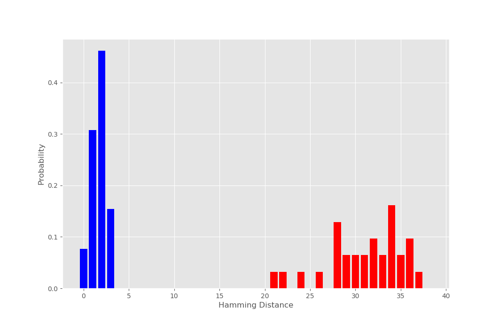
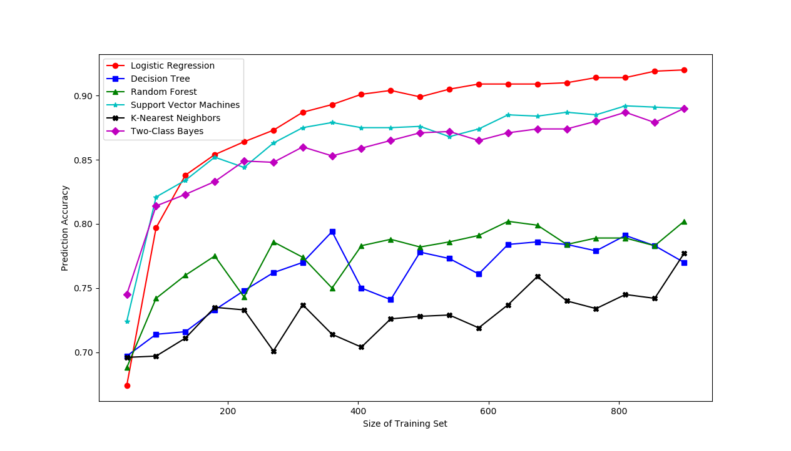

# puffery
Tools for PUF analysis.
Provides a collection of tests to analyze the output of PUFs.
There are two types of PUFs tests are provided for: weak and
strong PUFs.

## Dependencies

The OpenRAM compiler has very few dependencies:
+ Python 3.5 or higher
+ Python numpy        (pip3 install numpy to install)
+ Python scikit-learn (pip3 install scikit-learn to install)
+ Python matplotlib   (pip3 install matplotlib to install)

Packages have dependencies not listed here.

# Weak PUFs

Weak PUFs are characterized as having a small set of challenge-response
pairs (CRP). Puffery provides a script to compare the Hamming Distances (HD) of multiple
datasets to evaluate the intra-HD and inter-HD.
This script (hamming_distance.py) is located under scripts/weak_pufs.

## Usage



hamming_distance.py will compare the fingerprints (CRPs) of given PUF data. The script
will prompt for a specified directory for intra-PUF data and inter-PUF data. 
Both can be left blank and it will use example PUF data provided in the data sub-directory.
The script will plot the Hamming Distances with intra/inter-HD distinguished.

# Strong PUFs

Weak PUFs are characterized as having many CRPs. 
Puffery provides a script which using machine learning model from scikit-learn
to learn and re-create CRPs. The script utilizes six ML models which trains
on the data multiple times over varying amounts of training data to determine
how vulnerable the PUF is to learning attacks.
This script (sklearn_puf_models.py) is located under scripts/strong_pufs.

## Usage



sklearn_puf_models.py takes in data from a single PUF instance. The script
will prompt for a directory for this data and then it will prompt how much
data should be used for training and testing. Inputs can be left blank to
use example data provided and use default dataset splits (90% training/10% test).
The script will plot the accuracies of the models with a varying amount of training data.

# Example Output

```
python3 hamming_distance.py
Enter data directory for intra-Hamming distance (Default: data/intra_data_64b):
Using default data: data/intra_data_64b
Known Fingerprint:  [0, 1, 0, 1, 0, 0, 0, 1, 1, 1, 0, 1, 0, 1, 1, 1, 1, 0, 1, 1, 0, 1, 0, 0, 0, 0, 1, 0, 0, 1, 0, 1, 1, 0, 0, 1, 0, 0, 1, 1, 0, 1, 0, 0, 1, 1, 0, 1, 0, 0, 0, 0, 0, 1, 0, 0, 1, 1, 1, 1, 0, 0, 0, 0]
Expected Hamming Distance with other devices:  32
Hamming Distances from data/intra_data_64b/sram_puf_data_4_16_seed_0.csv :  [2, 2, 1, 1, 3, 1, 0, 2, 2, 2, 2, 1, 3]
Average intra-Hamming Distance:  1.6923076923076923
Enter data directory for inter-Hamming distance (Default: data/inter_data_64b):
Using default data: data/inter_data_64b
Hamming Distances from data/inter_data_64b/sram_puf_data_4_16_seed_10.csv :  [32]
Hamming Distances from data/inter_data_64b/sram_puf_data_4_16_seed_11.csv :  [30]
Hamming Distances from data/inter_data_64b/sram_puf_data_4_16_seed_12.csv :  [34]
Hamming Distances from data/inter_data_64b/sram_puf_data_4_16_seed_13.csv :  [32]
Hamming Distances from data/inter_data_64b/sram_puf_data_4_16_seed_14.csv :  [39]
Hamming Distances from data/inter_data_64b/sram_puf_data_4_16_seed_15.csv :  [30]
Hamming Distances from data/inter_data_64b/sram_puf_data_4_16_seed_16.csv :  [28]
Hamming Distances from data/inter_data_64b/sram_puf_data_4_16_seed_17.csv :  [29]
Hamming Distances from data/inter_data_64b/sram_puf_data_4_16_seed_18.csv :  [29]
Hamming Distances from data/inter_data_64b/sram_puf_data_4_16_seed_19.csv :  [28]
Hamming Distances from data/inter_data_64b/sram_puf_data_4_16_seed_2.csv :  [24]
Hamming Distances from data/inter_data_64b/sram_puf_data_4_16_seed_20.csv :  [33]
Hamming Distances from data/inter_data_64b/sram_puf_data_4_16_seed_21.csv :  [28]
Hamming Distances from data/inter_data_64b/sram_puf_data_4_16_seed_22.csv :  [37]
Hamming Distances from data/inter_data_64b/sram_puf_data_4_16_seed_23.csv :  [36]
Hamming Distances from data/inter_data_64b/sram_puf_data_4_16_seed_24.csv :  [35]
Hamming Distances from data/inter_data_64b/sram_puf_data_4_16_seed_25.csv :  [21]
Hamming Distances from data/inter_data_64b/sram_puf_data_4_16_seed_26.csv :  [34]
Hamming Distances from data/inter_data_64b/sram_puf_data_4_16_seed_27.csv :  [36]
Hamming Distances from data/inter_data_64b/sram_puf_data_4_16_seed_28.csv :  [34]
Hamming Distances from data/inter_data_64b/sram_puf_data_4_16_seed_29.csv :  [22]
Hamming Distances from data/inter_data_64b/sram_puf_data_4_16_seed_3.csv :  [34]
Hamming Distances from data/inter_data_64b/sram_puf_data_4_16_seed_30.csv :  [36]
Hamming Distances from data/inter_data_64b/sram_puf_data_4_16_seed_31.csv :  [28]
Hamming Distances from data/inter_data_64b/sram_puf_data_4_16_seed_32.csv :  [31]
Hamming Distances from data/inter_data_64b/sram_puf_data_4_16_seed_4.csv :  [33]
Hamming Distances from data/inter_data_64b/sram_puf_data_4_16_seed_5.csv :  [31]
Hamming Distances from data/inter_data_64b/sram_puf_data_4_16_seed_6.csv :  [34]
Hamming Distances from data/inter_data_64b/sram_puf_data_4_16_seed_7.csv :  [35]
Hamming Distances from data/inter_data_64b/sram_puf_data_4_16_seed_8.csv :  [26]
Hamming Distances from data/inter_data_64b/sram_puf_data_4_16_seed_9.csv :  [32]
Average inter-Hamming Distance:  31.322580645161292
```
